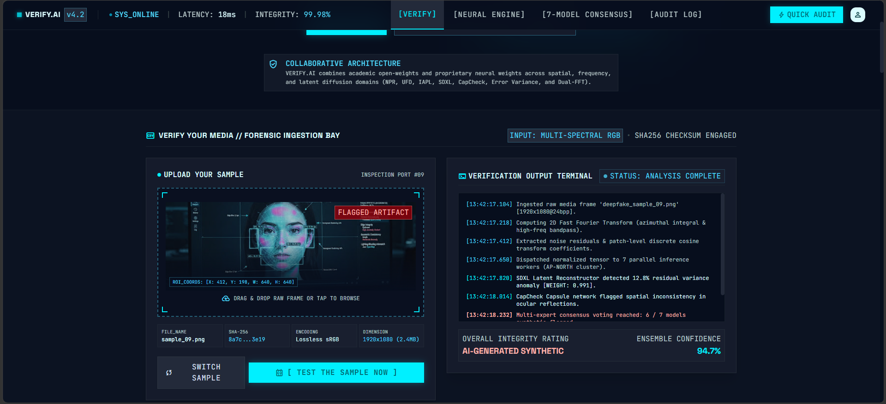
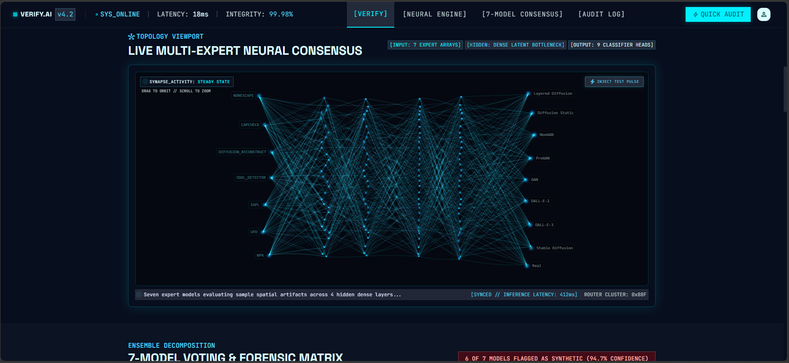
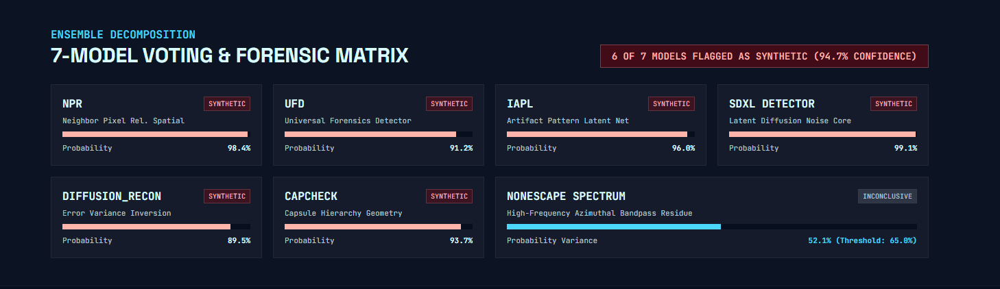
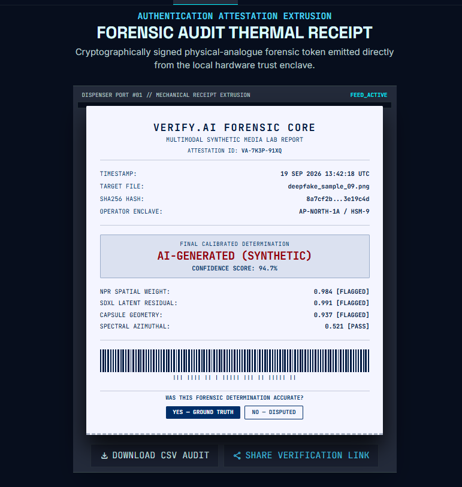

# VERIFY.AI — Deepfake Detection Gateway

   



### Neural Consensus Visualization



### 7-Model Consensus Ensemble Voting



### Thermal Receipt Output



> **Multi-modal deepfake detection system** that routes images to 7 specialist AI models via a FastAPI gateway and returns ensemble verdicts with full audit trails.

---

## What is VERIFY.AI?

VERIFY.AI is a microservice-based deepfake detection platform that combines 7 state-of-the-art detection models into a single API gateway. Upload any image and VERIFY.AI runs it through all models in parallel, then aggregates results using configurable ensemble strategies.

Built because no single model catches all deepfakes. Ensemble inference does.

---

## How It Works

```
Image File
    │
    ▼
┌──────────────────────────────────┐
│   FastAPI Gateway (:8000)        │  ← OAS 3.1, auto-docs at /docs
│   POST /api/detect               │
└────────────┬─────────────────────┘
             │ fan-out via asyncio.gather
     ┌───┬───┼───┬───┬───┬───┐
     ▼   ▼   ▼   ▼   ▼   ▼   ▼
   NPR  UFD IAPL SDXL UMM CAP NES    ← 7 voters on :5001–:5014
             │
      weighted voting
             │
             ▼
   unified JSON verdict + audit trail
```

---

## Project Structure

```
D:\VERIFY.AI\
├── gateway/
│   └── main.py                  ← FastAPI gateway (port 8000) — orchestrates all 7 voters
│
├── models/
│   ├── npr/main.py              ← port 5001 — Normal Probabilistic Residual
│   ├── ufd/main.py              ← port 5004 — Universal Frequency Domain
│   ├── iapl/main.py             ← port 5005 — IAPL (CLIP + DCT + SRM)
│   │   └── iapl_vendor/         ← vendored CLIP, DCT, SRM modules
│   ├── sdxl_detector/main.py    ← port 5009 — Stable Diffusion XL Detector
│   ├── umm_maybe/main.py        ← port 5010 — UMM-Maybe (AI detector)
│   ├── capcheck/main.py         ← port 5011 — Capsule Network check
│   ├── nonescape/main.py        ← port 5013 — NoneEscape
│   ├── crossvit/main.py         ← port 5014 — CrossViT ensemble
│   ├── rawnet/main.py           ← rawnet classifier
│   └── _archive/                ← archived/deprecated models
│
├── weights/                     ← downloaded model weights (offline, gitignored)
│   ├── npr.pth
│   ├── ufd.pth
│   ├── iapl_sd14.pth
│   ├── crossvit.pth
│   ├── nonescape-v0.safetensors
│   └── ViT-L-14.pt             ← CLIP ViT-L/14
│
├── hf_cache/                    ← HuggingFace cache (offline after 1st boot, gitignored)
│   └── hub/
│       ├── models--Organika--sdxl-detector/
│       ├── models--umm-maybe--AI-image-detector/
│       └── models--aaronkantrowitz--ai-image-detection/
│
├── frontend/                    ← React/Vite UI (port 3000)
│   ├── index.html               ← Stitch-designed forensic terminal
│   ├── package.json
│   ├── package-lock.json
│   ├── vite.config.js           ← proxy: /api → localhost:8000
│   └── src/
│       ├── api.js               ← detect(), history(), getDetection(), sendFeedback()
│       ├── styles.css           ← Stitch dark forensic theme
│       └── components/
│           ├── AuditLog.jsx
│           ├── Receipt.jsx
│           ├── Terminal.jsx
│           ├── Topology.jsx     ← Three.js Living Filament visualization
│           └── VotingMatrix.jsx
│
├── logs/
│   ├── detections_log.jsonl     ← audit trail
│   ├── feedback_log.jsonl
│   ├── gateway.log
│   └── *.log                    ← per-service logs
│
├── thumbnails/                  ← generated thumbnails (per verification, gitignored)
│
├── scripts/
│   ├── download_aigc_benchmark.py
│   ├── eval_benchmark.py
│   ├── eval_solo.py
│   ├── train_meta_learner.py
│   ├── topup_sdxl.py
│   └── wait_for_services.py
│
├── test_data/                   ← test images (gitignored)
│   ├── deepfake_folder/
│   ├── fake/
│   ├── real/
│   └── real_pic/
│
├── dataset/                     ← AIGC benchmark subset (1,800 images, gitignored)
│   ├── HF_FAKE/
│   └── HF_REAL/
│
├── results/                     ← evaluation outputs (gitignored)
│
├── venv/                        ← Python virtualenv (gitignored)
│
├── .gitignore
├── README.md
├── requirements.txt
├── docker-compose.yml
├── download_weights.py          ← automated weight download with retry
├── install_and_run.bat          ← one-click install & launch (Windows)
├── start_all.bat                ← quick restart all services (Windows)
├── start.sh                     ← Linux/Mac launcher
└── architecture.svg             ← system architecture diagram
```

---

## Quick Start

### Prerequisites
- Python 3.11+
- Node.js 18+ (for frontend)
- NVIDIA GPU recommended (CPU inference supported but slow)

### 1. Clone and install

```bash
git clone https://github.com/SoumalyaSaha/VERIFY.AI.git
cd VERIFY.AI
```

### 2. Create a virtual environment

```bash
python -m venv venv
venv\Scripts\activate        # Windows
# source venv/bin/activate   # Linux/Mac
```

### 3. Install dependencies

```bash
pip install --upgrade pip
pip install -r requirements.txt
```

> GPU support: replace `torch` in requirements.txt with the CUDA build:
> `pip install torch torchvision --index-url https://download.pytorch.org/whl/cu121`

### 4. Download model weights

```bash
venv\Scripts\python download_weights.py
```

This downloads all weights to `D:\VERIFY.AI\weights` and HuggingFace cache to `D:\VERIFY.AI\hf_cache`. Takes ~10 min on first run, instant on subsequent runs.

### 5. Start all services

```bat
install_and_run.bat
```

Quick relaunch without reinstalls: `start_all.bat`

### Services

| Service | URL |
|---|---|
| **Frontend** | http://localhost:3000 |
| Gateway API | http://localhost:8000 |
| Interactive docs | http://localhost:8000/docs |
| NPR model | http://localhost:5001 |
| UFD model | http://localhost:5004 |
| IAPL model | http://localhost:5005 |
| SDXL-detector | http://localhost:5009 |
| umm-maybe | http://localhost:5010 |
| CapCheck model | http://localhost:5011 |
| Nonescape model | http://localhost:5013 |

---

## API

### `POST /api/detect`

Upload an image for deepfake analysis.

**Request** — `multipart/form-data`
```
file       : image file (required)
media_type : "image" (default)
models     : comma-separated model names (optional, runs all by default)
strategy   : "weighted" | "average" | "vote" (default: "weighted")
```

**Response**
```json
{
  "verification_id": "VA-N102-58EG",
  "feedback_token": "fb-abc123",
  "receipt": {
    "verdict": "fake",
    "confidence_label": "SYNTHETIC",
    "confidence": 0.847,
    "models_responded": 7,
    "models_total": 7
  },
  "model_breakdown": [
    {
      "model": "NPR",
      "internal_name": "npr",
      "label": "Noise Pattern Recognition",
      "score": 0.984,
      "vote": "fake",
      "display_type": "probability"
    },
    {
      "model": "IAPL",
      "internal_name": "iapl",
      "label": "Frequency-domain CLIP",
      "score": 0.521,
      "vote": "real",
      "display_type": "probability"
    }
  ],
  "thumbnail_url": "/thumbnails/va-n102-58eg.jpg"
}
```

### `POST /api/feedback`

Submit ground-truth feedback on a detection.

```json
{
  "feedback_token": "fb-abc123",
  "user_verdict": "correct"
}
```

### `GET /api/history`

Retrieve audit log with filtering.

```
GET /api/history?filter=all&search=&limit=50&offset=0
```

Filters: `all`, `synthetic`, `authentic`, `disputed`

### `GET /api/detect/{verification_id}`

Retrieve full record for a specific detection.

---

## Frontend

The React/Vite frontend at `http://localhost:3000` provides:

- **Upload Terminal** — drag & drop or click to upload images
- **Neural Consensus Topology** — Three.js Living Filament visualization of 7-model voting
- **7-Model Voting Matrix** — real-time probability bars and verdict badges
- **Thermal Receipt** — printable attestation with SHA256, verdict, and confidence
- **Audit Log** — filterable table of all past detections

Built from Stitch design export (project `18196254217642893748`).

---

## Offline Operation

After the first boot, VERIFY.AI runs **fully offline** with no internet required:

```bat
:: Add to start_all.bat (already configured)
set HF_HUB_OFFLINE=1
set TRANSFORMERS_OFFLINE=1
start_all.bat
```

Cached on disk:
- `D:\VERIFY.AI\weights\` — model weight files
- `D:\VERIFY.AI\hf_cache\` — HuggingFace model cache
- `D:\temp\clip_cache\` — CLIP ViT-L/14
- `D:\temp\torch_cache\` — PyTorch hub cache
- `frontend/public/` — vendored Tailwind, Three.js, fonts

---

## Active Models

| Model | Port | What It Detects |
|---|---|---|
| **NPR** (Noise Pattern Recognition) | 5001 | GAN-generated images via noise artifacts |
| **UFD** (UniversalFakeDetect) | 5004 | Broad-spectrum AI-generated image detection |
| **IAPL** (Frequency-domain CLIP) | 5005 | Diffusion + GAN via DCT/SRM features |
| **SDXL-Detector** | 5009 | Stable Diffusion, DALL-E, Midjourney |
| **UMM-Maybe** | 5010 | Multi-generator AI image detection |
| **CapCheck** | 5011 | Capsule network spatial inconsistency |
| **NoneEscape** | 5013 | Adversarial-aware deepfake detection |

---

## Tech Stack

| Layer | Technology |
|---|---|
| Frontend | React, Vite, Three.js, Tailwind CSS |
| Gateway | FastAPI (Python 3.11) |
| Inference | PyTorch, torchvision, transformers |
| Models | 7 specialist deepfake detectors |
| API Spec | OpenAPI 3.1 |
| Design | Stitch forensic terminal theme |

---

## Author

**Soumalya Saha** — [GitHub](https://github.com/SoumalyaSaha)

Also built: [ArtifactX](https://github.com/SoumalyaSaha/ArtifactX) — AI-powered museum guide with multilingual artifact identification
